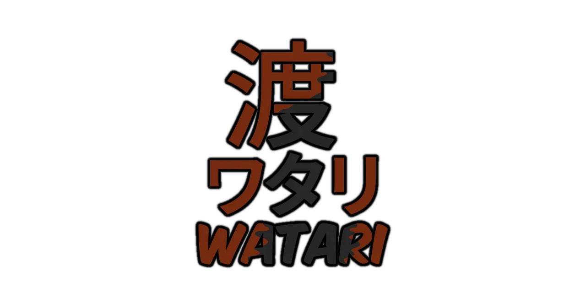
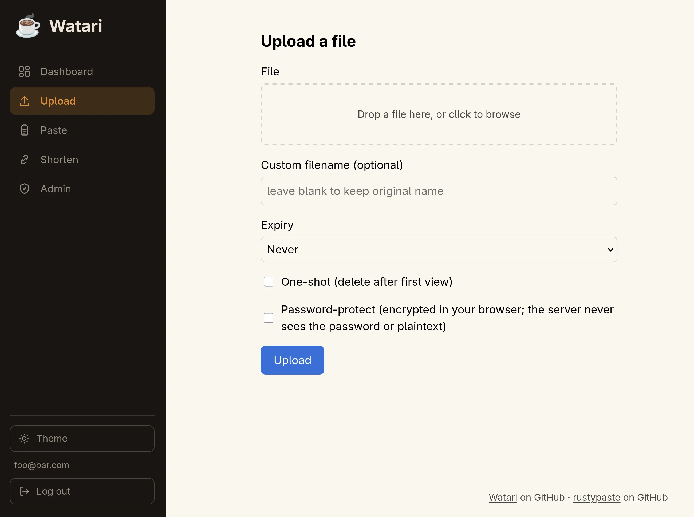

# ☕ Watari

> [!NOTE]
> 🤖 This project has been vibe-coded with Claude. Read bottom section to learn more.

**Watari** is a web GUI frontend for [rustypaste](https://github.com/orhun/rustypaste).

The project name comes from the japanese word **渡り** (`watari`, also written as **ワタリ** in [Katakana](https://en.wikipedia.org/wiki/Katakana)) which means ["crossing, passage, transit"](https://jisho.org/search/%22watari%22) and symbolizes the relationship with **rustypaste**.



<p align="center">
    <a href="https://github.com/coko7/watari/releases/latest"></a>
    <a href="LICENSE"></a>
    
    <a href="https://github.com/coko7/watari/actions/workflows/rust.yml"></a>
</p>

> [!WARNING]
> 🚧 **Early stages — big work in progress.** Expect rough edges and breaking changes. 🚧

On top of providing a GUI, it comes with some additional features:

- 🔐 [OpenID Connect](https://openid.net/developers/how-connect-works/) Single sign-on (tested against [Zitadel](https://zitadel.com/) and [Microsoft Entra ID)](https://www.microsoft.com/en-us/security/business/identity-access/microsoft-entra-id))
- 🗂️ Per-group token mapping
- 🔒 Optional client-side ([WebCrypto](https://developer.mozilla.org/en-US/docs/Web/API/Web_Crypto_API)) password encryption

All built with a ***based*** technical stack: [axum](https://github.com/tokio-rs/axum) + [Askama](https://github.com/askama-rs/askama) + [HTMX](https://htmx.org/) + [SQLite](https://sqlite.org)

This project has been **vibe-scaffolded** with [Claude](https://claude.ai), you can find the full design here: [`watari.md`](./watari.md)

<p align="center">
  
</p>

## Table of contents

- [Running with Docker Compose (recommended)](#running-with-docker-compose-recommended)
  - [OIDC groups setup](#oidc-groups-setup)
- [Running locally for development](#running-locally-for-development)
- [Project layout](#project-layout)
- [License](#license)
- [AI usage / vibe coding](#ai-usage--vibe-coding)

## Running with Docker Compose (recommended)

1. `cp env.example .env` and fill in `SESSION_SECRET` (`openssl rand -hex 32`),
   `OIDC_CLIENT_SECRET`, and two distinct `RUSTYPASTE_TOKEN_*` secrets.
2. `cp rustypaste-config.example.toml rustypaste-config.toml` and paste the
   same two rustypaste token values into `auth_tokens`/`delete_tokens`.
3. `cp token-bindings.example.yaml token-bindings.yaml` and adjust the
   `groups` to match your IdP (see "OIDC groups setup" below).
4. Edit `docker-compose.yml`'s `OIDC_ISSUER_URL`, `OIDC_CLIENT_ID`,
   `APP_BASE_URL`/`RUSTYPASTE_PUBLIC_URL` for your deployment.
5. `docker compose up -d --build`

### OIDC groups setup

Watari maps OIDC groups to rustypaste tokens via `token-bindings.yaml`
(§7 in `watari.md`), so the groups claim must actually be present in the
ID token. Two env vars control this: `OIDC_GROUPS_CLAIM` (which claim to
read groups from) and `OIDC_GROUPS_SCOPE` (an extra scope some IdPs need
requested before they'll populate that claim).

**Zitadel** — groups come from [project
roles](https://zitadel.com/docs/guides/integrate/service-users/authenticate-service-users),
not org groups:

1. In your Zitadel project, define roles under **Roles**, then grant them
   to users (directly or via an org role grant).
2. Either enable **"Assert Roles on Authentication"** in the project's
   general settings, or request the roles scope explicitly — Watari does
   the latter:

   ```
   OIDC_GROUPS_CLAIM=urn:zitadel:iam:org:project:roles
   OIDC_GROUPS_SCOPE=urn:zitadel:iam:org:project:roles
   ```

3. `token-bindings.yaml`'s `groups` entries should match the role keys
   you defined (e.g. `admin`, `user`).

**Microsoft Entra ID** — groups come from the token configuration, no
extra scope needed:

1. In the app registration, go to **Token configuration** → **Add
   groups claim**, and pick Security groups (or All groups). Add it to
   the ID token.
2. Leave `OIDC_GROUPS_SCOPE` unset; set:

   ```
   OIDC_GROUPS_CLAIM=groups
   ```

3. By default Entra ID emits group **object IDs** (GUIDs), not names —
   `token-bindings.yaml`'s `groups` entries need to be those GUIDs.
   Alternatively, use **App roles** instead of security groups (assign
   users/groups to roles in the app registration) and set
   `OIDC_GROUPS_CLAIM=roles`, which emits the human-readable role value
   strings instead.
4. Entra ID caps the groups claim at 200 groups per token ("[overage](https://learn.microsoft.com/en-us/entra/identity-platform/id-token-claims-reference#groups-overage-claim)")
   — above that it omits `groups` entirely and expects a Graph API call
   instead, which Watari does not do. Prefer App roles if a user could
   belong to that many groups.

## Running locally for development

Requires Rust (edition 2024, so a recent stable toolchain) and no external
services besides an OIDC provider and a rustypaste instance to point at.

```sh
cargo build
cargo test
export $(cat .env | xargs)  # or set the vars below directly
cargo run
```

Required environment variables (see `watari.md` §5 for the full list with
defaults): `OIDC_ISSUER_URL`, `OIDC_CLIENT_ID`, `OIDC_CLIENT_SECRET`,
`OIDC_REDIRECT_URI`, `SESSION_SECRET`, `RUSTYPASTE_INTERNAL_URL`,
`RUSTYPASTE_PUBLIC_URL`, `APP_BASE_URL`. A `token-bindings.yaml` must also
exist at `TOKEN_BINDINGS_PATH` (default `token-bindings.yaml`), with each
`env_var` it references set.

Database migrations run automatically at startup (`DATABASE_PATH`, default
`/data/app.db` — for local dev, point this somewhere writable, e.g.
`./dev.db`).

## Project layout

- `src/` — the Axum application; see `CLAUDE.md` for a module-by-module map.
- `templates/` — Askama HTML templates, compiled into the binary at build time.
- `static/` — served as-is at `/static` (vendored HTMX, `app.css`, `app.js`).
- `migrations/` — sqlx SQL migrations, embedded into the binary at build time.
- `token-bindings.example.yaml` — OIDC-group → rustypaste-token mapping (§7).
- `rustypaste-config.example.toml` — matching rustypaste server config.

## License

AGPLv3 — see [`LICENSE`](./LICENSE).

## AI usage / vibe coding

The initial project scaffolding was done via a technical spec generated by Claude and further features/fixes have been done with Claude as well.

I have spent some time reading through the code, testing and troubleshooting things myself but far less
than I should have given the current project size.

I would like to reduce my AI usage and take back ownership of the code but I have honestly haven't had the time
to do so.
